# chasenunez — GitHub Activity

This README is automatically updated weekly with a summary of my recent GitHub activity (commits, repositories, and language composition).

## Top repositories (commit density)

## Languages (weekly composition)

---

_Last update: 2025-12-12T13:23:38.740Z_
